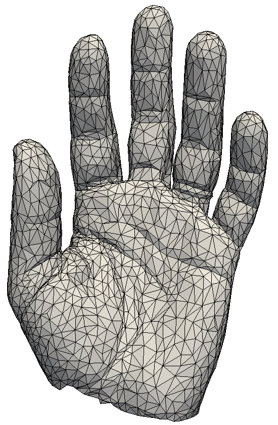

# CPSC 524, Digital geometry processing projects

## Surface subdivision

The code implements [butterfly
subdivision](http://citeseerx.ist.psu.edu/viewdoc/download?doi=10.1.1.133.8925&rep=rep1&type=pdf),
[sqrt(3)-subdivision](https://www.graphics.rwth-aachen.de/media/papers/sqrt31.pdf),
and finally [Loop
subdivision](https://people.eecs.berkeley.edu/~sequin/CS284/TEXT/loop87.pdf).

## Mesh simplification

The code in this folder implements two mesh simplification
algorithms. [Vertex
decimation](http://citeseerx.ist.psu.edu/viewdoc/download?doi=10.1.1.492.2840&rep=rep1&type=pdf)
and [Garland's edge collapse via quadratic error
metrics](https://www.ri.cmu.edu/pub_files/pub2/garland_michael_1997_1/garland_michael_1997_1.pdf).

Below is an example of the Chinese dragon mesh taken from the
aim@shape repository. The original image shown below has roughly 600,000 vertices.

Using the edge collapse algorithm this mesh is simplified to 8855 and
1715 vertices, respectively, and shown in the figures below.

Using the vertex decimation algorithm this mesh is simplified to 8855
and 3829 vertices, respectively, and shown in the figures below. The
vertex decimation implementation could not go beyond 3829. It is quite
evident that the vertex decimation algorithm produces a less desirable
result compared to that of edge collapse.

## As-rigid-as-possible mesh deformation

## Surface remesher

This folder implementes a surface remesher from the paper [ Explicit
surface
remeshing](http://www.cs.technion.ac.il/%7Egotsman/AmendedPubl/SGP/SGP03.pdf).
As an example, the remeshed models of a hand and Max Planks bust are
shown here. There is also a [report](./demo/dgp.pdf) and a
[presentation](./demo/dgp_pres.pdf).

 

