# CPSC 524, Digital geometry processing projects

## Surface subdivision

The code implements [butterfly
subdivision](http://citeseerx.ist.psu.edu/viewdoc/download?doi=10.1.1.133.8925&rep=rep1&type=pdf),
[sqrt(3)-subdivision](https://www.graphics.rwth-aachen.de/media/papers/sqrt31.pdf),
and finally [Loop
subdivision](https://people.eecs.berkeley.edu/~sequin/CS284/TEXT/loop87.pdf).

## Mesh simplification

The code in this folder implements two mesh simplification
algorithms. [Vertex
decimation](http://citeseerx.ist.psu.edu/viewdoc/download?doi=10.1.1.492.2840&rep=rep1&type=pdf)
and [Garland's edge collapse via quadratic error
metrics](https://www.ri.cmu.edu/pub_files/pub2/garland_michael_1997_1/garland_michael_1997_1.pdf).

Below is an example of the Chinese dragon mesh taken from the
aim@shape repository. The original image shown below has roughly 600,000 vertices.

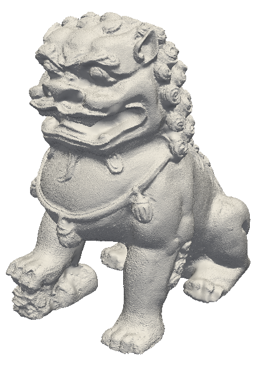

Using the edge collapse algorithm this mesh is simplified to 8855 and
1715 vertices, respectively, and shown in the figures below.

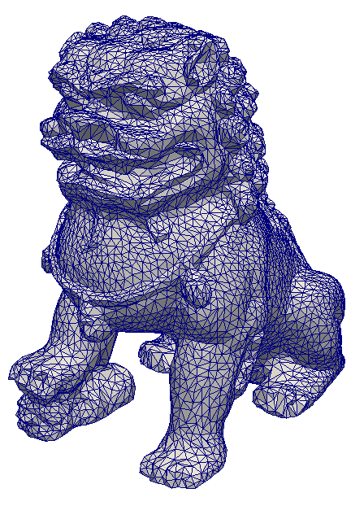
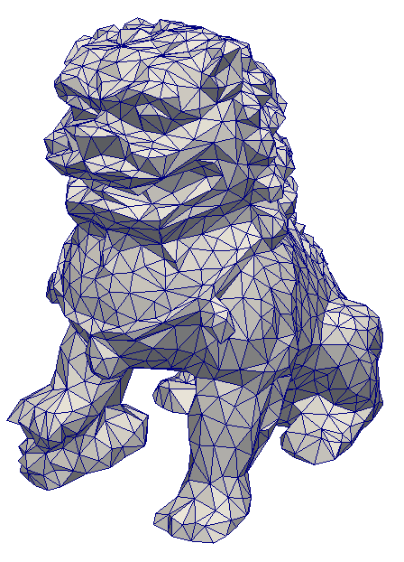

Using the vertex decimation algorithm this mesh is simplified to 8855
and 3829 vertices, respectively, and shown in the figures below. The
vertex decimation implementation could not go beyond 3829. It is quite
evident that the vertex decimation algorithm produces a less desirable
result compared to that of edge collapse.

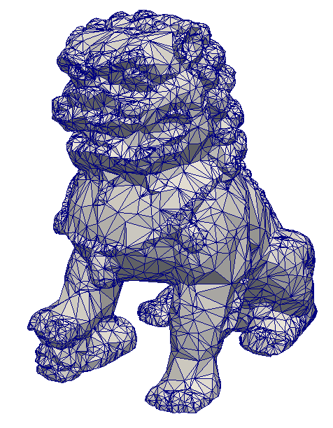
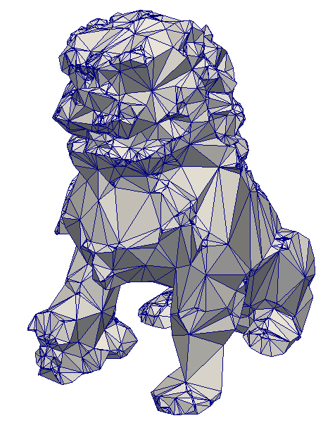

## As-rigid-as-possible mesh deformation

The project includes an application for interactive deformation of
meshes using the ARAP method.

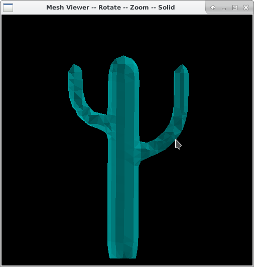
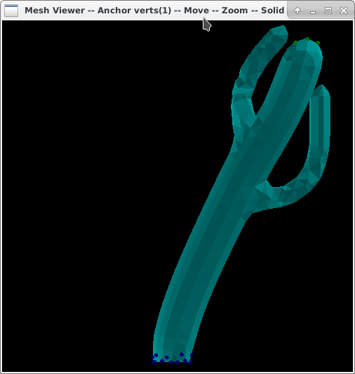
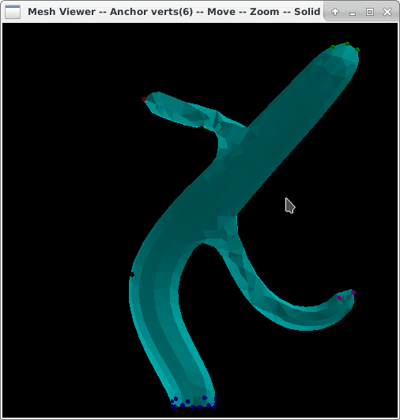

## Surface remesher

This folder implementes a surface remesher from the paper [ Explicit
surface
remeshing](http://www.cs.technion.ac.il/%7Egotsman/AmendedPubl/SGP/SGP03.pdf).
As an example, the remeshed models of a hand and Max Planks bust are
shown here. There is also a [report](./docs/dgp.pdf) and a
[presentation](./docs/dgp_pres.pdf).

 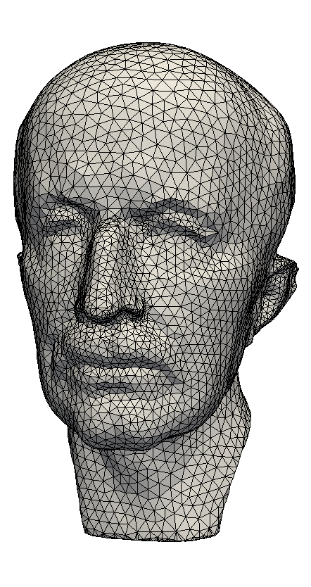

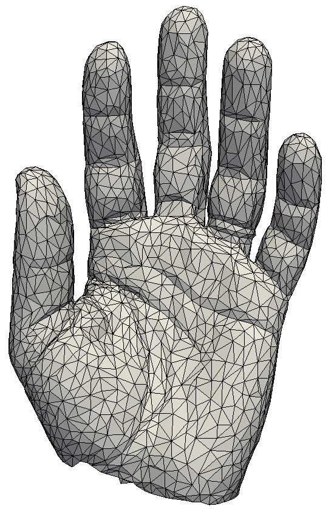
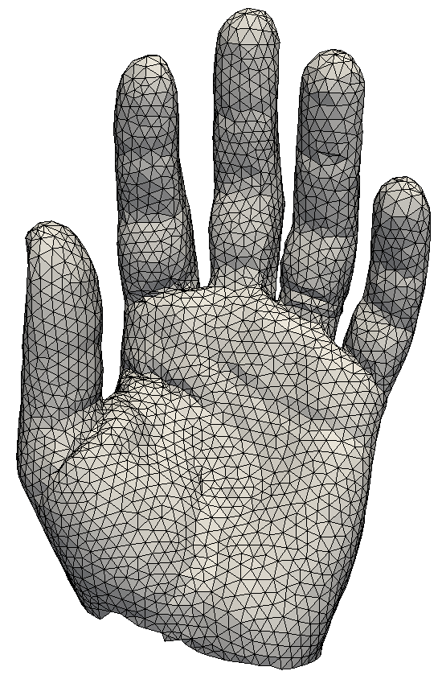

## A Basic Ray Tracer Boosted with K-D Trees


```
make METHOD=opt -> optimized build
make METHOD=dbg -> debug build

./raytracer[.opt]
```

By default, this will render a scene with only a red cube and save the
resulting image as output.bmp.

To run the executable and render a different scene, pass it as the
first argument:

```
./bin/raytracer[.opt] your_scene_file_path
```

Here is an example (approximate run time 5 minutes).

```
./bin/raytracer.opt scenes/dragon.obj

Rendering scenes/dragon.ray
Output to scenes/dragon_out.bmp
got OBJ filename "meshes/Dragon.obj"
Mesh: 50000 triangles
Normals are already defined! But still doing flat shading.
got OBJ filename "meshes/teapot.obj"
Mesh: 6320 triangles
got OBJ filename "meshes/cow1.obj"
Mesh: 5804 triangles
got OBJ filename "meshes/icosahedron.obj"
Mesh: 20 triangles
Near: 1
Far: 20
Height: 0.535898
Width: 0.712745
Ray centered at: 1.2434 3.533 12 0
Corner1: 0.779874 3.52031 11.0081 0
Corner2: 1.48864 3.5221 10.933 0
Corner3: 1.50519 3.00608 11.0766 0
Corner4: 0.796417 3.00428 11.1518 0
Row 0 pixels done.
Row 100 pixels done.
Row 200 pixels done.
Row 300 pixels done.
Row 400 pixels done.
Row 500 pixels done.
Row 600 pixels done.
Row 700 pixels done.
Row 800 pixels done.
Row 900 pixels done.
Ray tracing terminated and images are saved.
```
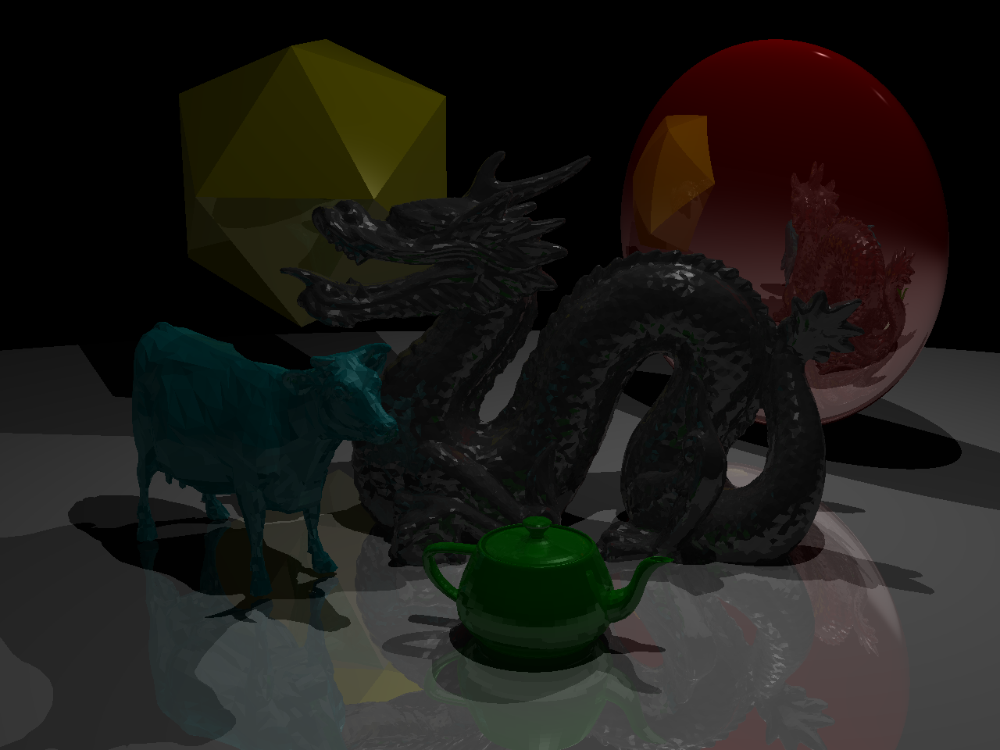

